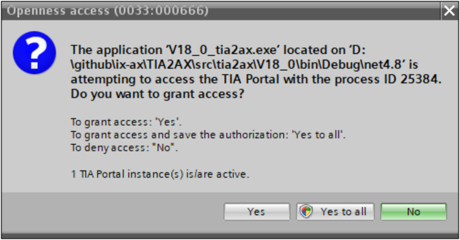
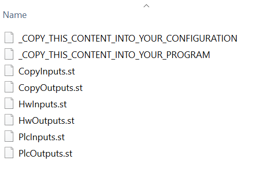

# WORK IN PROGRESS....
# TIA2AX
Provides tool to transfer HW configuration from TIA portal to AX's data structures

TIA2AX is a CLI tool exporting the IO image of all connected devices to each PLC inside the TiaPortal project.
It takes two arguments:
- ` -x, --tia-source-project` - Absolut path to the TiaPortal project (to the *.ap18 file).
- `-o, --output-folder` - Absolut path to the output directory, where the result will be placed.

As this tool is just the temporary solution until the HWC will be done, it supports only TiaPortal project of version V18.0.
If neccessary there could be released a new version for newer version of TiaPortal, but for the simpliness as a separate tool.

### Example of using TIA2AX for version V18.0
    preconditions:  TiaPortal V18.0 including TiaOpeness installed
                    TiaPortal project that is going to be processed is compiled and saved (does not has to be closed).
                    Current user is added to the group `Siemens TIA Openess` see: https://support.industry.siemens.com/cs/mdm/109815199?c=101778035467&lc=en-WW


- run command line prompt 
- navigate to the folder where the .exe file of the tool is located
- for the current version V18.0 of the TiaPortal (at the time of creating this documentation) run the command as in this example
- V18_0_tia2ax.exe -x "D:\_tmp\S7_1516_example\S7_1516_example.ap18" -o "D:\_tmp\Export"
- In case that you are prompted to grant the access, click `Yes to all`.


- after export is finished, navigate to the output folder. Depending on the number of the PLCs used inside the TiaPortal project, respective number of subfolders named by each PLC name should be created.

Each folder should have following content:



All the files with the extension `.st` need to be copied into respective AX project.

The content of the file `_COPY_THIS_CONTENT_INTO_YOUR_CONFIGURATION` needs to be copied into your configuration. It should then look as follows:
```csharp
CONFIGURATION YourConfiguration
    TASK Main(Interval := T#10ms, Priority := 1);
    PROGRAM P1 WITH Main: YourProgram;

    VAR_GLOBAL
	HwInputs AT %IB0 : HwInputs;
	HwOutputs AT %QB0 : HwOutputs;
	PlcInputs : PlcInputs;
	PlcOutputs : PlcOutputs;
    END_VAR
END_CONFIGURATION
```
So as the content of the file `_COPY_THIS_CONTENT_INTO_YOUR_PROGRAM` needs to be copied into your program. It should then look as 
follows:
```csharp
PROGRAM YourProgram
    VAR_EXTERNAL
	PlcInputs : PlcInputs;
	PlcOutputs : PlcOutputs;
    END_VAR
    //This must be very first
    CopyInputs();

    //Place your logic here

    //This must be very last
    CopyOutputs();
END_PROGRAM

```
